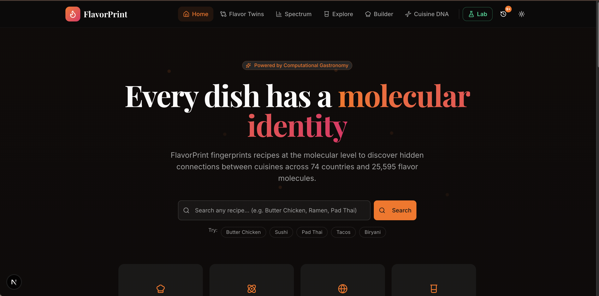
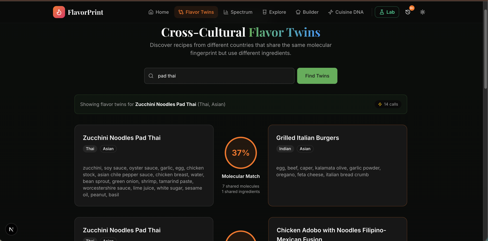
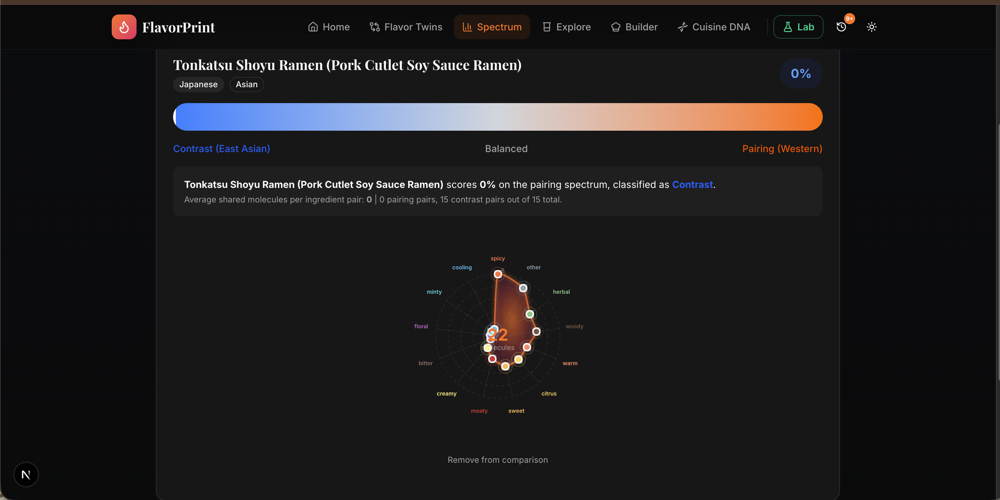
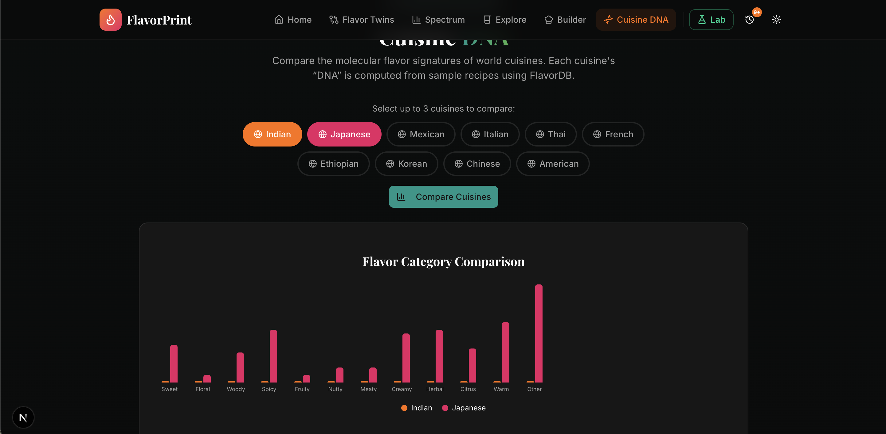
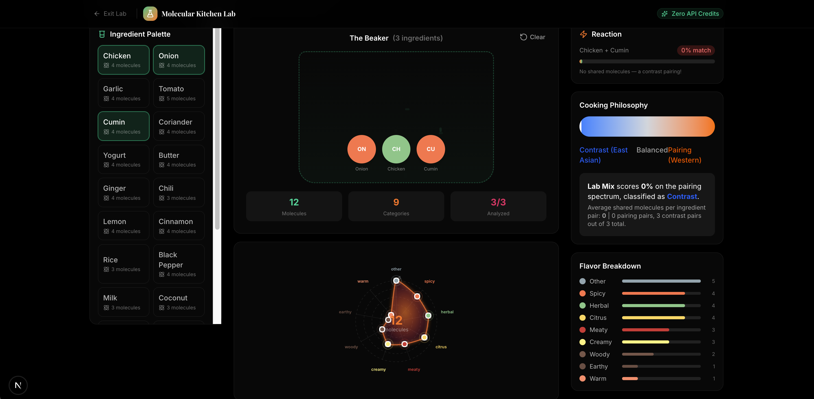
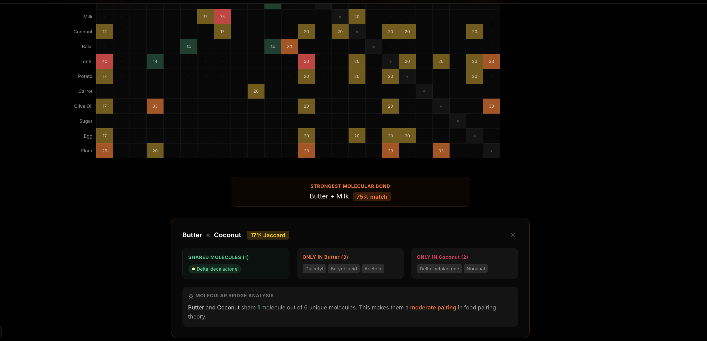
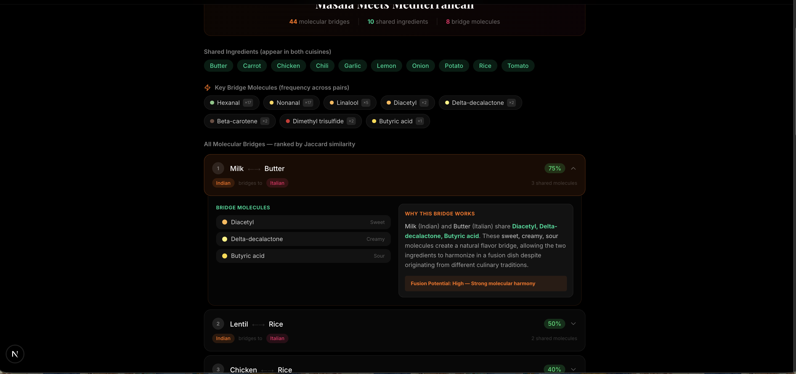
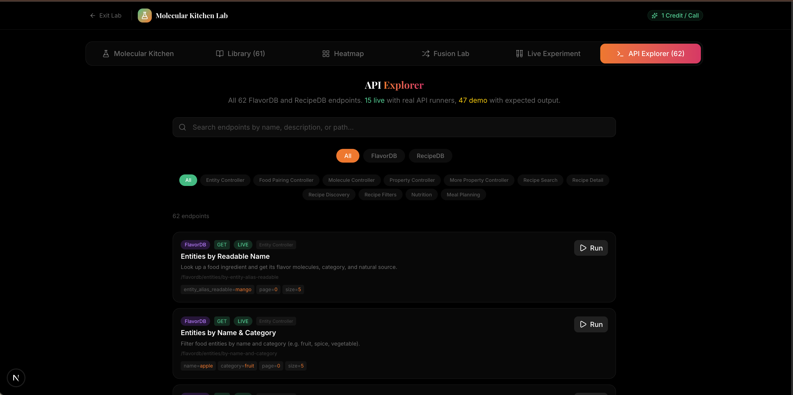

<div align="center">


<a href="https://git.io/typing-svg"></a>

<br/>

[](https://nextjs.org/)
[](https://www.typescriptlang.org/)
[](https://tailwindcss.com/)
[](https://d3js.org/)

[](https://cosylab.iiitd.edu.in/recipedb/)
[](https://cosylab.iiitd.edu.in/flavordb/)
[](#)


</div>

---

## The Problem

> *"Finding recipes is easy. Understanding **why** flavors work together, discovering your dish has a twin 6,000km away, and exploring the molecular science behind every bite -- that's what's missing."*

With **118,000+ recipes across 74 countries** in RecipeDB and **25,595 flavor molecules** in FlavorDB, the data exists. But no one has connected these datasets to reveal the hidden molecular relationships between the world's cuisines. **FlavorPrint** bridges this gap.

---

## Features at a Glance

### 1. Home -- Recipe Search Hub
Search 118K+ recipes by title, view Recipe of the Day, track search history with smart caching.



### 2. Flavor Twins -- Cross-Cultural Discovery
Find recipes from **different countries** that share the same molecular fingerprint. *"This Thai Pad Thai and an Italian Burger share 37% molecular identity."* Suggestion chips for quick access.



### 3. Philosophy Spectrum -- Pairing vs Contrast
Classify any recipe on the **Pairing vs Contrast** spectrum (Ahn et al., 2011). Western cuisines pair ingredients sharing molecules; East Asian cuisines contrast them. Full radial FlavorPrint visualization.



### 4. Cuisine DNA -- Multi-Cuisine Comparison
Compare molecular profiles of up to **3 cuisines** side-by-side. 5 preset combos (e.g. Indian vs Japanese). Visualize flavor category breakdown with bar charts.



### 5. Molecular Kitchen Lab
A black-themed experimental workspace with **6 sub-modules**:

| Module | What it Does |
|--------|-------------|
| **Molecular Kitchen** | Drag-and-drop ingredients into a beaker, see real-time molecular reactions |
| **Formula Library** | 55+ pre-built experiments across 10 cuisines with full molecular breakdowns |
| **Compatibility Heatmap** | Visual matrix of Jaccard similarity between ingredient pairs |
| **Fusion Lab** | Combine cuisines to generate novel fusion recipes with molecular backing |
| **Live Molecular Analysis** | Search ANY ingredient, get its full molecular profile with comparison mode |
| **API Explorer** | Browse & test all 62 FlavorDB + RecipeDB endpoints live |









---

## Tech Stack

| Layer | Technology |
|-------|-----------|
| Framework | Next.js 16.1.6 (App Router, Turbopack) |
| Language | TypeScript 5 (strict) |
| Styling | Tailwind CSS 4 + shadcn/ui + Radix UI |
| Visualization | D3.js 7.9 + Recharts |
| Animation | Framer Motion 12 |
| State | Zustand 5 |
| Data Fetching | TanStack React Query 5 |
| APIs | RecipeDB + FlavorDB (CoSyLab, IIIT Delhi) |

---

## Architecture

```
                    +---------------------------+
                    |      FlavorPrint UI        |
                    |  Next.js 16 + D3.js + FM   |
                    +------------+--------------+
                                 |
                    +------------+--------------+
                    |  API Layer (Cache + Proxy) |
                    |  24h localStorage cache    |
                    |  History tracking          |
                    +-----+------------+--------+
                          |            |
                 +--------+--+  +-----+-------+
                 | RecipeDB   |  | FlavorDB     |
                 | 118K       |  | 25,595       |
                 | recipes    |  | molecules    |
                 | 74 countries|  | 936 entities |
                 +------------+  +-------------+
                     (cosylab.iiitd.edu.in)
```

**Key Algorithms:**
- **Molecular Fingerprinting** -- Aggregate flavor molecules per ingredient, classify into 8 categories, generate radial chart
- **Cross-Cultural Twinning** -- Jaccard similarity on molecule sets + low ingredient overlap = high twin score
- **Philosophy Spectrum** -- Average shared molecules per ingredient pair vs random baseline
- **Ingredient Compatibility** -- Pairwise Jaccard similarity heatmap across ingredient palette

---

## Foodoscope API Usage

We use **both RecipeDB and FlavorDB** extensively:

**FlavorDB Endpoints (Entity, Molecule, Food Pairing, Property Controllers):**
- `/entities/by-entity-alias-readable` -- Search ingredients
- `/entities/by-name-and-category` -- Filter by category
- `/entities/by-natural-source` -- Filter by natural source
- `/food/by-alias` -- Food pairing suggestions
- `/molecules_data/by-flavorProfile` -- Molecules by flavor
- `/molecules_data/by-commonName` -- Molecule lookup
- `/molecules_data/filter-by-type` -- Chemical type filter
- `/properties/by-description` -- Property search
- `/properties/taste-threshold` -- Taste threshold filter

**RecipeDB Endpoints:**
- `/recipe-bytitle/recipeByTitle` -- Search 118K+ recipes
- `/search-recipe/{id}` -- Full recipe details
- `/instructions/{recipe_id}` -- Cooking instructions
- `/recipe/recipeofday` -- Recipe of the Day
- `/recipe/recipesinfo` -- Paginated recipe list
- `/recipes_cuisine/cuisine/{region}` -- Filter by cuisine

**62 total endpoints** documented and testable in our API Explorer.

---

## API Issue Log

During development we documented several API bugs and gaps. See **[ISSUES.md](ISSUES.md)** for the full report including:

- Entity endpoint returning metadata without molecules
- Parameter naming inconsistencies (camelCase vs snake_case)
- Missing entity-to-molecules mapping endpoint

---

## Quick Start

```bash
git clone https://github.com/ayushap18/Codecatalysts.git
cd Codecatalysts/app

# Create .env.local with your API key
echo "NEXT_PUBLIC_API_KEY=your_api_key_here" > .env.local

npm install
npm run dev
# Open http://localhost:3000
```

---

## Project Structure

```
app/src/
├── app/
│   ├── page.tsx              # Home (search, recipe of day)
│   ├── twins/page.tsx        # Flavor Twins
│   ├── spectrum/page.tsx     # Philosophy Spectrum
│   ├── explore/page.tsx      # Ingredient Explorer
│   ├── builder/page.tsx      # Recipe Builder
│   ├── cuisine/page.tsx      # Cuisine DNA
│   ├── playground/           # Molecular Kitchen Lab
│   │   ├── page.tsx          # 6-tab lab workspace
│   │   ├── experiments.ts    # 55+ pre-built experiments
│   │   ├── api-endpoints.ts  # 62 API endpoint definitions
│   │   ├── heatmap.tsx       # Compatibility heatmap
│   │   └── fusion.tsx        # Fusion recipe generator
│   ├── recipe/[id]/page.tsx  # Recipe detail view
│   └── api/proxy/route.ts    # HTTPS proxy layer
├── components/               # Reusable UI components
├── lib/
│   ├── algorithms/           # Fingerprint, similarity, spectrum scoring
│   └── api/                  # RecipeDB + FlavorDB wrappers + cache
├── types/                    # TypeScript interfaces
└── stores/                   # Zustand state
```

---

## The Science

Built on two foundational research papers:

1. **Garg, N. et al.** "FlavorDB: a database of flavor molecules" -- *Nucleic Acids Research*, 2017
2. **Ahn, Y-Y. et al.** "Flavor network and the principles of food pairing" -- *Scientific Reports*, 2011

---

## Team: CodeCatalysts

**ForkIT Challenge 2026** | IIIT Delhi CoSyLab

---

<div align="center">


**Built with science, served with flavor.**

</div>
